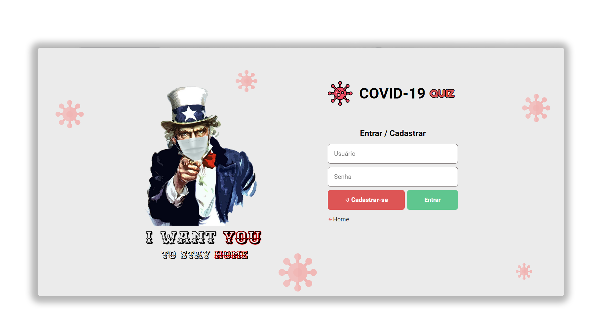

<h1 align="center">
    <br>
</h1>

<p align="center">
  
  
  <a href="https://opensource.org/licenses/MIT">
    
  </a>
</p>



# Summary
- [What is this?](#what-is-this)
- [Techs used](#techs-used)
- [Getting started](#getting-started)
- [Useful URLs](#useful-urls)

<a id="what-is-this"></a>

## :thinking: What is this?

Basically a Monorepo of a <strong>Web</strong> and <strong>Server</strong> application that helps people to consult cases of covid-19 and play some mini-games. 

This application was developed for an academic work by the <strong>UNINOVE</strong> institution distributed by professor <strong>Debora Canne</strong>.
The idea of ​​creating an application focused on good practices and access to information about <strong>covid-19</strong> arose from the need to raise awareness among people during the pandemic.

<a id="techs-used"></a>

## :rocket: Techs used

- **Node.js** - A JavaScript Interpreter
- **Yarn** - A Better Node Package Manager
- **MySQL** - A Relational Database
- **Sequelize** - A Object-Relational-Mapping for Database
- **ReactJS** - A Frontend Framework

<a id="getting-started"></a>

## :fire: Getting started

- ### You may **need** to install:

    - A Distributed **Version-Control-System** -> [Git](https://git-scm.com/ "Git")
    - A JavaScript **Interpreter** -> [Node.js](https://nodejs.org/ "Node.js")
    - Some **Package Manager** Like -> [NPM](https://www.npmjs.com/) **or** [Yarn](https://yarnpkg.com/)
    - The Relational **Database** -> [MySQL](https://www.mysql.com/ "MySQL")


1. Clone this repo with:
```sh
  $ git clone https://github.com/matheus2x/covid-quiz.git
```
2. Move yourself to the appropriate directory: `$ cd covid-quiz`
3. Installing dependencies and starting:
```sh
  ## Server
  $ cd backend
  $ yarn

  ## In .env.example file, change the credentials.
  ## Rename .env.example to only .env
```
```sh
  # Create Database
  $ yarn sequelize db:create

  # Use the Migrations to Create Tables
  $ yarn sequelize db:migrate

  # Populate Database with the seeds
  $ yarn sequelize db:seed:all

  # Run Server
  $ yarn dev
```
```sh
  ## Web
  $ cd frontend
  $ yarn

  ## Run Web
  $ yarn start
```

<a id="useful-urls"></a>

## :link: Useful URLs

- [Git](https://git-scm.com/ "Git")
- [Node](https://nodejs.org/ "Node")
- [Yarn](https://yarnpkg.com/ "Yarn")
- [MySQL](https://www.mysql.com/ "MySQL")
- [Sequelize](https://sequelize.org/ "Sequelize")
- [ReactJS](https://reactjs.org/ "ReactJS")

---

<h4 align="center">
    Made with :fox_face: by <a href="https://www.linkedin.com/in/matheus2x/" target="_blank">Matheus Henrique</a>
</h4>